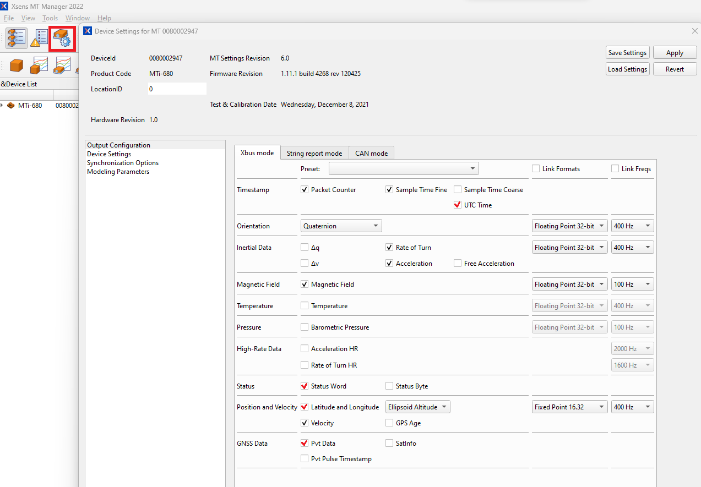
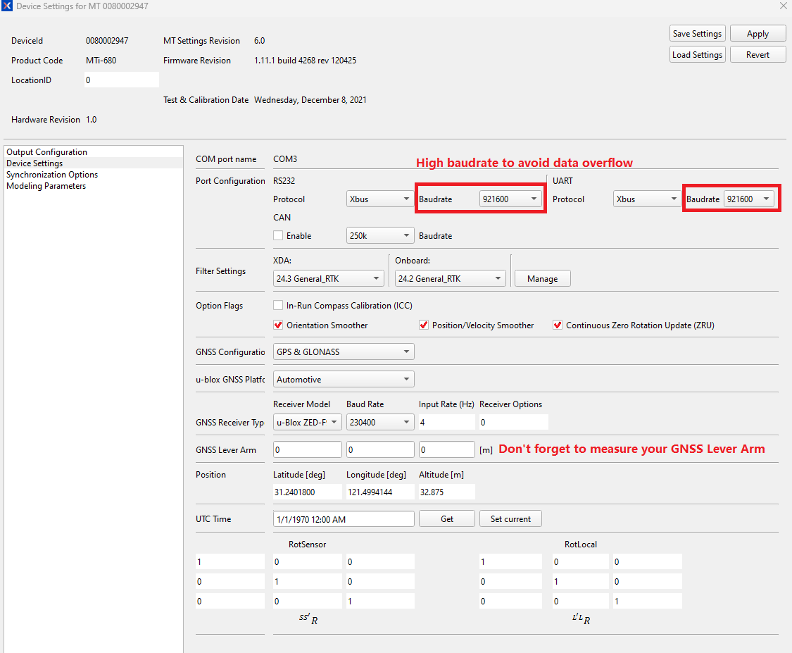

# Xsens MTi ROS2 Driver and Ntrip Client

This code was based on the [bluespace_ai_xsens_ros_mti_driver](https://github.com/bluespace-ai/bluespace_ai_xsens_ros_mti_driver) and the official Movella 2023 [Open source Xsens Device API](https://base.xsens.com/s/article/Introduction-to-the-MT-SDK-programming-examples-for-MTi-devices) tested on MTi-680 with ROS2 Humble at Ubuntu 22.04.3 LTS .

## ROS vs ROS2 Versions

Note that this branch contains the ROS2 implementation for the packages. If you are looking for the ROS1 version, you should go to the [`main`](https://github.com/jiminghe/Xsens_MTi_ROS_Driver_and_Ntrip_Client/tree/main) branch

## How to clone this ROS2 branch

```
git clone --recursive --branch ros2 https://github.com/jiminghe/Xsens_MTi_ROS_Driver_and_Ntrip_Client.git
```

## Device Settings - Output Configurations
#### Note: the UTC Time, SampleTimeFine, Status Word, Latitude and Longitude needs to be enabled, in order to get GPGGA data for topic ``/nmea``: MT Manager - Device Settings - Output Configuration , select "UTC Time, Sample TimeFine, Status Word, Latitude and Longitude" and other required data, click "Apply"

Here are the recommended Output Configurations and Device Settings:





## Changes made to the MTi ROS Driver:

 - add ``xsens_time_handler`` , to give user option to use UTC Time from the MTi sensor.
 - add ``ntrip_util``, to support the /nmea topic
 - add ``xsens_log_handler``, to support the ``should_log`` option in the ``xsens_mti_node.yaml``
 - add ``nmeapublisher.h`` under ``src/messagepublisher`` folder, to send GPGGA message, ``/nmea`` rostopic. The ``/nmea`` messages will be generated by PvtData, but if you have enabled SendLatest Time Synchronization option, you won't be able to get PvtData, even there is trigger, in that case, the ``/nnmea`` messages will be generated by ``packet.UtcTime(), packet.status(), packet.latitudeLongitude()``. The ``/nmea`` messages are published at approximately 1Hz.
 - add ``gnssposepublisher.h`` under ``src/messagepublisher`` folder, to send position+orientation in one message, ``/gnss_pose`` rostopic.
 - add ``utctimepublisher.h`` under ``src/messagepublisher`` folder, to send utctime(if available) , ``/imu/utctime`` rostopic. 
 - add ``XsStatusWord.msg``, used to publish ``/status`` topic

change:
 - ``lib/xspublic/xscontroller/iointerface.h``, line 138, change to ``PO_OneStopBIt`` for PO_XsensDefaults.
 - ``lib/xspublic/xscommon/threading.cpp``, updated to work with glibc 2.35 in ubuntu 22 OS.

## Ntrip_Client
The Ntrip_client subscribes to the ``/nmea`` rostopic from ``xsens_mti_ros2_driver``, and wait until it gets data for maximum 300 sec, it will send GPGGA to the Ntrip Caster(Server) every 1 second.

User needs to change the ``ntrip_launch.py`` for their own credentials/servers/mountpoint. 

## How to Install:
install dependency:
```
sudo apt install ros-[ROSDISTRIBUTION]-nmea-msgs
sudo apt install ros-[ROSDISTRIBUTION]-mavros-msgs
```
for example for ROS2 Humble:
```
sudo apt install ros-humble-nmea-msgs
sudo apt install ros-humble-mavros-msgs
```

change the NTRIP credentials/servers/mountpoint in ``src/ntrip/launch/ntrip_launch.py`` to your own one.

clone the source file to your ``ros2_ws``, and run the code below:
```
cd ~/ros2_ws
pushd src/xsens_mti_ros2_driver/lib/xspublic && make && popd
colcon build
```

Source the ``install/setup.bash`` file inside your ROS2 workspace
```
source install/setup.bash
```
or 

add it into rules:
```
sudo nano ~/.bashrc
```
At the end of the file, add the following line:
```
source /home/[USER_NAME]/ros2_ws/install/setup.bash
```
save the file, exit.

## How to Use:
open first terminal:
```
ros2 launch xsens_mti_ros2_driver xsens_mti_node.launch.py
```
or with the 3D display rviz:
```
ros2 launch xsens_mti_ros2_driver display.launch.py
```
and then open another terminal
```
roslaunch ntrip ntrip.launch
```

## How to confirm your RTK Status

you could check ``ros2 topic echo /rtcm``, there should be HEX RTCM data coming,

or ``ros2 topic echo /status`` to check the RTK Fix type, it should be 1(RTK Floating) or 2(RTK Fix).


## ROS Topics

| topic                    | Message Type                    | Message Contents                                                                                                                              | Data Output Rate<br>(Depending on Model and OutputConfigurations at MT Manager) |
| ------------------------ | ------------------------------- | --------------------------------------------------------------------------------------------------------------------------------------------- | ------------------------------------------------------------------------------- |
| filter/free_acceleration | geometry_msgs/Vector3Stamped    | free acceleration from filter, which is the acceleration in the local earth coordinate system (L) from which<br>the local gravity is deducted | 1-400Hz(MTi-600 and MTi-100 series), 1-100Hz(MTi-1 series)                      |
| filter/positionlla       | geometry_msgs/Vector3Stamped    | filtered position output in latitude (x), longitude (y) and altitude (z) as Vector3, in WGS84 datum                                           | 1-400Hz(MTi-600 and MTi-100 series), 1-100Hz(MTi-1 series)                      |
| filter/quaternion        | geometry_msgs/QuaternionStamped | quaternion from filter                                                                                                                        | 1-400Hz(MTi-600 and MTi-100 series), 1-100Hz(MTi-1 series)                      |
| filter/twist             | geometry_msgs/TwistStamped      | velocity and angular velocity                                                                                                                 | 1-400Hz(MTi-600 and MTi-100 series), 1-100Hz(MTi-1 series)                      |
| filter/velocity          | geometry_msgs/Vector3Stamped    | filtered velocity output as Vector3                                                                                                           | 1-400Hz(MTi-600 and MTi-100 series), 1-100Hz(MTi-1 series)                      |
| gnss                     | sensor_msgs/NavSatFix           | raw 4 Hz latitude, longitude, altitude and status data from GNSS receiver                                                                     | 4Hz                                                                             |
| gnss_pose                | geometry_msgs/PoseStamped       | filtered position output in latitude (x), longitude (y) and altitude (z) as Vector3 in WGS84 datum, and quaternion from filter                | 1-400Hz(MTi-600 and MTi-100 series), 1-100Hz(MTi-1 series)                      |
| imu/acceleration         | geometry_msgs/Vector3Stamped    | calibrated acceleration                                                                                                                       | 1-400Hz(MTi-600 and MTi-100 series), 1-100Hz(MTi-1 series)                      |
| imu/angular_velocity     | geometry_msgs/Vector3Stamped    | calibrated angular velocity                                                                                                                   | 1-400Hz(MTi-600 and MTi-100 series), 1-100Hz(MTi-1 series)                      |
| imu/data                 | sensor_msgs/Imu                 | quaternion, calibrated angular velocity and acceleration                                                                                      | 1-400Hz(MTi-600 and MTi-100 series), 1-100Hz(MTi-1 series)                      |
| imu/dq                   | geometry_msgs/QuaternionStamped | integrated angular velocity from sensor (in quaternion representation)                                                                        | 1-400Hz(MTi-600 and MTi-100 series), 1-100Hz(MTi-1 series)                      |
| imu/dv                   | geometry_msgs/Vector3Stamped    | integrated acceleration from sensor                                                                                                           | 1-400Hz(MTi-600 and MTi-100 series), 1-100Hz(MTi-1 series)                      |
| imu/mag                  | sensor_msgs/MagneticField     | calibrated magnetic field                                                                                                                     | 1-100Hz                                                                         |
| imu/time_ref             | sensor_msgs/TimeReference       | SampleTimeFine timestamp from device                                                                                                          | depending on packet                                                             |
| imu/utctime              | sensor_msgs/TimeReference       | UTC Time from the device                                                                                                                      | depending on packet                                                             |
| nmea                     | nmea_msgs/Sentence              | 1Hz GPGGA data from GNSS receiver PVTData(if available), otherwise from filtered position, utctime, status packet                             | 1Hz                                                                             |
| pressure                 | sensor_msgs/FluidPressure       | barometric pressure from device                                                                                                               | 1-100Hz                                                                         |
| status                   | xsens_mti_ros2_driver/msg/XsStatusWord | statusWord, 32bit                                                                                                                             | depending on packet                                                             |
| temperature              | sensor_msgs/Temperature         | temperature from device                                                                                                                       | 1-400Hz(MTi-600 and MTi-100 series), 1-100Hz(MTi-1 series)                      |
| tf                       | geometry_msgs/TransformStamped  | transformed orientation                                                                                                                       | 1-400Hz(MTi-600 and MTi-100 series), 1-100Hz(MTi-1 series)                      |

Please refer to [MTi Family Reference Manual](https://mtidocs.xsens.com/mti-system-overview) for detailed definition of data. 
